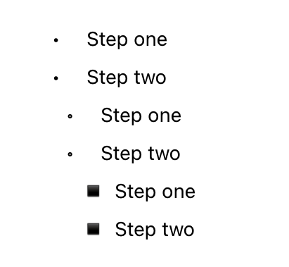
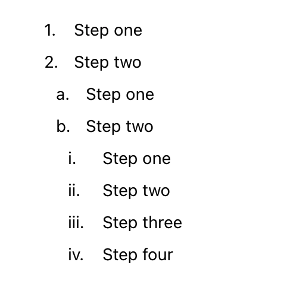
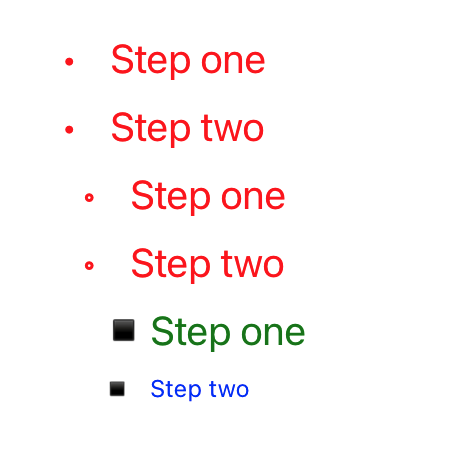

# react-native-lists

Web-like `<UnorderedList>`, `<OrderedList>`, and `<ListItem>` components for
React Native.

## Basic Usage

### Unordered List

|  |
| ---------------------------------------- |
| Example of an `<UnorderedList>`          |

```jsx
<UnorderedList>
  <ListItem>Step one</ListItem>
  <ListItem>Step two</ListItem>
  <UnorderedList>
    <ListItem>Step one</ListItem>
    <ListItem>Step two</ListItem>
    <UnorderedList>
      <ListItem>Step one</ListItem>
      <ListItem>Step two</ListItem>
    </UnorderedList>
  </UnorderedList>
</UnorderedList>
```

### Ordered List

|  |
| -------------------------------------- |
| Example of an `<OrderedList>`          |

```jsx
<OrderedList>
  <ListItem>Step one</ListItem>
  <ListItem>Step two</ListItem>
  <OrderedList>
    <ListItem>Step one</ListItem>
    <ListItem>Step two</ListItem>
    <OrderedList>
      <ListItem>Step one</ListItem>
      <ListItem>Step two</ListItem>
      <ListItem>Step three</ListItem>
      <ListItem>Step four</ListItem>
    </OrderedList>
  </OrderedList>
</OrderedList>
```

## Props

### `UnorderedList`

| Prop               | Type                | Default | Description                                                                                             |
| ------------------ | ------------------- | ------- | ------------------------------------------------------------------------------------------------------- |
| `depth`            | `number`            | `auto`  | Used for `getSymbol` function.                                                                          |
| `getSymbol`        | `func`              |         | Function called to get symbol. <br/> **Signature:** <br/> `function(depth) => string`                   |
| `itemWrapperStyle` | `object` \| `array` |         | Passed to all children if not defined for child. See `ListItem`.                                        |
| `symbol`           | `string`            |         | Define custom symbol string. Passed to all `ListItem` children if not defined by child. See `ListItem`. |
| `symbolStyle`      | `object` \| `array` |         | Passed to all children if not defined for child. See `ListItem`.                                        |

### `OrderedList`

| Prop               | Type                 | Default | Description                                                                                  |
| ------------------ | -------------------- | ------- | -------------------------------------------------------------------------------------------- |
| `depth`            | `number`             | `auto`  | Used for `getSymbol` function.                                                               |
| `getSymbol`        | `func`               |         | Function called to get symbol. <br/> **Signature:** <br/> `function(count, depth) => string` |
| `itemWrapperStyle` | `object` \| `array`  |         | Passed to all children if not defined for child. See `ListItem`.                             |
| `reversed`         | `bool`               | `false` | Reverses count order for children.                                                           |
| `start`            | `string` \| `number` |         | Define custom start count.                                                                   |
| `symbolStyle`      | `object` \| `array`  |         | Passed to all children if not defined for child. See `ListItem`.                             |

### `ListItem`

| Prop               | Type                | Default         | Description                                                                              |
| ------------------ | ------------------- | --------------- | ---------------------------------------------------------------------------------------- |
| `itemWrapperStyle` | `object` \| `array` |                 | Styles for `<View>` that wraps `children`.                                               |
| `symbol`           | `string`            |                 | Define custom symbol string.                                                             |
| `symbolCharCount`  | `number`            | `symbol.length` | Define custom symbol character count used for `width` of the `<Text>` wrapping `symbol`. |
| `symbolStyle`      | `object` \| `array` |                 | Styles passed to `<Text>` wrapping `symbol`.                                             |

## Style Strategy

This project experiments with a few controversial styling strategies.

### Inheritance

The goal is to achieve web-like style inheritance, where a parent's styles pass
to a child unless overwritten by a child.

- `<UnorderedList` and `<OrderedList>` pass `style` prop to outer `<View>`.
- `<UnorderedList` and `<OrderedList>` pass `style` prop to all children.
- `<ListItem>` groups `layoutStyle`, `textStyle`, `viewStyle` according to React
  Native docs:
  - [Layout Props](https://reactnative.dev/docs/layout-props)
  - [Text Style Props](https://reactnative.dev/docs/text-style-props)
  - [View Style Props](https://reactnative.dev/docs/view-style-props)
- `<ListItem>` passes `layoutStyle` and `viewStyle` to outer `<View>`.
- `<ListItem>` passes `textStyle` to `<Text>` wrapping `symbol`.
- `<ListItem>` passes `textStyle` to `<Text>` wrapping `children` if
  `typeof children === 'string'`.

### Dynamic Symbol Width

Tries to establish a `symbol` width for all sibling `<ListItem>` to account for
varying `symbol.length` values. If parts of your `symbol` string are breaking
onto a new line:

1. **Temporary Fix**: Pass `symbolStyle` to parent `<UnorderedList>` or
   `<OrderedList>`, or to all `<ListItem>`, specifying a `width` value that
   prevents the line break.
1. [Open an issue](https://github.com/b2io/react-native-lists/issues) to let me
   know.

### Example

|  |
| ----------------------------------------- |
| Example of style inheritance.             |

```jsx
<UnorderedList style={{ color: 'red', fontSize: 20 }}>
  <ListItem>Step one</ListItem>
  <ListItem>Step two</ListItem>
  <UnorderedList>
    <ListItem>Step one</ListItem>
    <ListItem>Step two</ListItem>
    <UnorderedList style={{ color: 'blue', fontSize: 12 }}>
      <ListItem style={{ color: 'green', fontSize: 20 }}>Step one</ListItem>
      <ListItem>Step two</ListItem>
    </UnorderedList>
  </UnorderedList>
</UnorderedList>
```

## Known Issues

### Roman Numeral Justification

In HTML (and most word processors), the Roman numerals used in Ordered Lists are
**right-justified**. I believe this is because Roman numeral strings expand into
multiple characters very quickly, and so these extra characters can extend to
the left rather than to the right so as to avoid requiring dynamic width
calculations like this project uses.

## Similar Projects

- [react-native-unordered-list](https://github.com/xiqi/react-native-unordered-list)
